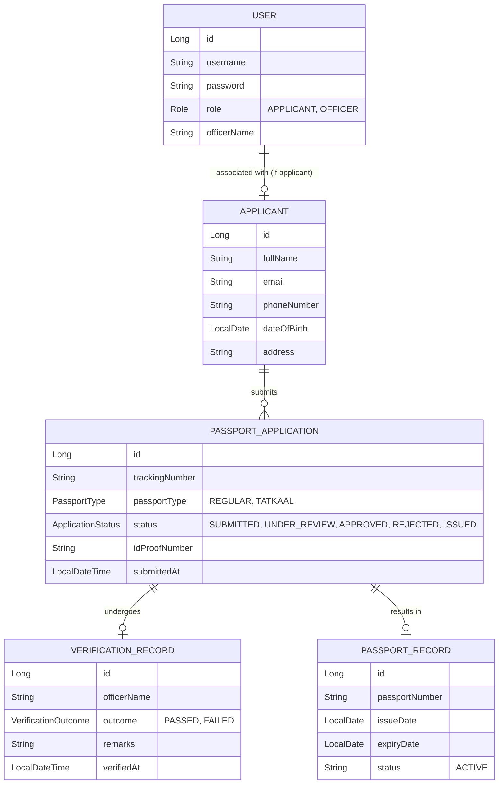

# Passport Automation & Management System (OOAD)

An Object-Oriented Passport Automation System built with Java & Spring Boot 3. It automates applicant registration, passport application submission, officer verification, and centralized passport records management with strict role-based access control.

---

## Role-Based Access Control (RBAC)

When users visit the system, they are prompted to log in or register. Access is segregated across two primary roles:

| Role | Permissions & Actions |
|---|---|
| **APPLICANT** | • Register / Sign in.<br>• Submit passport applications (auto-linked to their identity).<br>• View & track their own applications.<br>• *Forbidden from accessing Officer verification and passport issuance.* |
| **OFFICER** | • Sign in to the Officer Verification Desk.<br>• Filter and review submitted applications.<br>• Record verification decisions (Approve / Reject) with audit remarks.<br>• Issue official 10-year passports with unique passport numbers. |

### Preloaded Demo Credentials

For quick testing and presentation, the following accounts are pre-configured:

- **Applicants**:
  - `john` / `password123` (John Doe — has 1 submitted application `PASS-2026-DEMO01`)
  - `jane` / `password123` (Jane Smith — has 1 approved application ready to issue `PASS-2026-DEMO02`)
  - `robert` / `password123` (Robert Brown — has 1 active issued passport `PASS-2026-DEMO03`)
- **Verification Officers**:
  - `officer_davis` / `officer123` (Officer Davis)
  - `officer_clark` / `officer123` (Officer Clark)

---

## System Architecture & OOAD Design



---

## How to Run

### Launching the Application
Execute from the project directory:
```bash
mvn spring-boot:run
```

Once running:
- **Web Portal**: [http://localhost:8080](http://localhost:8080)
- **OpenAPI / Swagger UI**: [http://localhost:8080/swagger-ui.html](http://localhost:8080/swagger-ui.html)
- **H2 Database Console**: [http://localhost:8080/h2-console](http://localhost:8080/h2-console)
  - JDBC URL: `jdbc:h2:mem:passportdb`
  - User Name: `sa`
  - Password: *(blank)*
